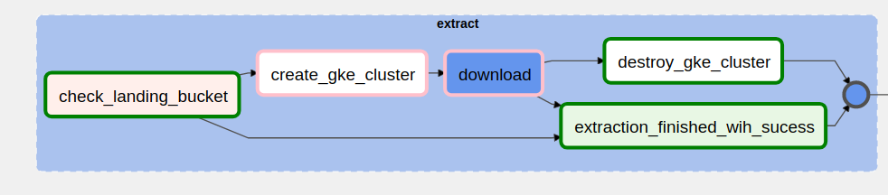
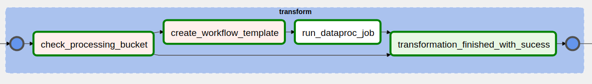
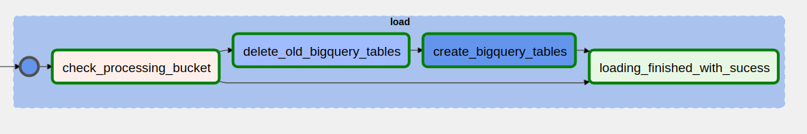

# ETL Censo Escolar 


Esse projeto implementa um pipeline de ETL para os dados do [Censo Escolar](https://www.gov.br/inep/pt-br/areas-de-atuacao/pesquisas-estatisticas-e-indicadores/censo-escolar)
utilizando Google Cloud Plataform. 

Os principais recursos da GCP utilizados nesse projeto são o [Composer (Airflow)](https://cloud.google.com/composer),
[GKE (Kubernetes)](https://cloud.google.com/kubernetes-engine), [Dataproc (Spark)](https://cloud.google.com/dataproc)
e [BigQuery](https://cloud.google.com/bigquery). Uma [conta GCP recém criada](https://cloud.google.com/free)
consegue rodar gratuitamente esse projeto. 

O GKE, Dataproc e BigQuery são provisionados pelo Composer. 
O Composer, por sua vez, é provisionado pelo fantástico [Terraform](https://www.terraform.io/). 

O deploy é realizado com poucos comandos no Google Cloud Shell, precisando fazer nada localmente.

## Dados 
#### [Download](https://www.gov.br/inep/pt-br/acesso-a-informacao/dados-abertos/microdados/censo-escolar)
Para esse projeto foram coletados os dados de 2011 até 2020. Em cada ano são 12 arquivos .CSVs: 
5 para matriculas (1 por região do BR),
5 para docentes (1 por região do BR), e 1 arquivo de turmas e escolas.
Em 2019 e 2020 também existe um arquivo para gestores.

## Deploy

1. Faça um fork desse projeto para a sua conta Github.
2. Crie um [projeto](https://console.cloud.google.com/cloud-resource-manager) GCP novo. O nome do projeto será 
utilizado com prefixo dos buckets onde serão armezanados os dados.
3. Acesse [Google Cloud Build](https://console.cloud.google.com/cloud-build/triggers) e crie uma conexão com seu repositório Github.
4. Entre no Google Cloud Shell. O ícone dele está na parte superior do console, próximo a foto da sua conta Google. 
   No aba do Cloud Shell clique no botão ```Abrir editor``` para abrir o Visual Studio Code. Pode ser que o editor não abra porque os cookies de terceiros estão desativados no navegador. Para
contornar isso, pode-se abrir uma exceção para o Cloud Shell no ícone que na direita da barra de endereço.
6. No Visual Studio Code abra um terminal e clone o fork que você realizou desse projeto.
7. No arquivo ```~/etl_censo_escolar/infra/variables.tf``` coloque o nome do projeto que você criou no passo 2 e o
   seu usuário Github. 
8. Execute ```make init``` para ativar as APIs do GCP necessárias para o projeto e para instalar os
plugins Terraform.
9. Execute ```make apply```. Será printado o plano de deploy do Terraform. Digite yes para aceitar esse plano e começar o deploy do projeto.
11. Após o deploy do último componente (Composer), será printado que um componente não foi deployado corretamente.
    Isso aconteceu porque nesse primeiro apply foi baixado um arquivo no mesmo caminho de build de uma imagem Docker. 
O terraform buga e não constrói a imagem. Para resolver isso basta executar ```make apply``` novamente.
    
12. Ao final de apply será printado o link de acesso do Airflow da GCP, o Composer.
13. As dags do Composer e os arquivos de ETL utlizados pelo Dataproc e BigQuery são sincronizados com o seu repositório Github. 
A sincronização acontece sempre que haver um commit no repositório remoto. Portanto, faça um commit e um push das suas alterações.
    
14. Deploy finalizado! 

# Infraestrutura


A infraestrutura do projeto se divide entre aquela provisionada pela Terraform utilizando o comando ```make apply```
e aquela provisionada pelo Composer ao trigar a dag **censo-escolar**.

## Infraestrutura provisionada pelo Terraform
Visa provisionar o Composer e todos os outros componentes que não podem ser
provisionados no Composer, que são:
 - 3 Google Storage Bucket, um para armazenar os dados extraídos do site do INEP, 
   um para os dados transformados e um para os scripts utilizados pelo ETL.
     
 - 2 Google Build Trigger, um para sincronizar as DAGs e outro os scripts de ETL com os arquivos que estão
   no repositório Github.
   
 - Imagem Docker utilizada que é salva no Google Cloud Container Registry e que será 
   usada por um Pod GKE na parte da extração. 

 - BigQuery Dataset de nome **censo_escolar**.
   
 - Service Account para permitir que o Pod de extração no GKE e o script de transformação no Dataproc consigam 
   baixar e upar arquivos do Storage.
   
 - E finalmente o Composer, o Airflow da GCP, que irá orquestar o ETL.

## Infraestrutura provisionada pelo Composer
Através de operadores do Google, é possível criar e destruir os componentes que fazem de fato o ETL, que são:
 - Um cluster GKE: consegue rodar até 10 pods, cada um extraindo os dados de um **ano entre 2011 e 2020**.
 - Um cluster Dataproc com Pyspark: para executar os jobs de transformação em cima dos dados extraídos pelo GKE.
 - Tabelas BiqQuery: cria ou atualiza as tabelas **matrículas**, **docentes**, **gestores**, ***turmas***
   e **escolas** no dataset **censo_escolar**. 
   

# ETL

## Extração

1. Verifica quais anos entre 2011 e 2020 não estão no Landing Bucket. 
   
2. Se houver algum ano faltando, é criado um cluster no GKE para instanciar os pod de extraçãp. 
   O tamanho do cluster é definido dinamicamente e será de no máximo 24 Cores de CPU, que é a cota máxima de Cores numa região para
um conta GCP de teste. O fluxo de extração é realizado de forma pararela para cada ano.
   
3. Dentro do pod extração, primeiro é baixado o ZIP contendo os dados do site do INEP, extraídos e
upados no Landing Bucket como arquivos CSV.
   

## Transformação

1. Verifica quais anos entre 2011 e 2020 não estão no Processing Bucket.
2. Se houver alguma ano faltando é criado um Cluster, com 1 nodo master e 2 workers, cada um
de 8 cores e 52 RAM. Um fluxo serial executa a transformação dos arquivos presentes em cada ano.
   
3. Para simplificar essa parte do pipeline, a leitura dos CSVs do Landing Bucket
   utiliza o schema feito a partir daquilo explicado no dicionário de dados de 2020.
4. A transformação com Pyspark começa com mapeamento das colunas categóricas usando um json
construido no notebook maps.ipynb.

5. Colunas de data são convertidas de string para DateType.

6. Colunas de inteiros e booleanos são convertidos para os seus respectios tipos em Spark.

7. Algumas colunas de booleanos são criadas a partir de um OR lógicos de outras 2 colunas booleanas.

8. As tabelas escolas, turmas e gestores são configuradas para serem salvas em apenas 1 arquivo
   parquet, já que são
tabelas pequenas. Docentes e matrículas terão aproximadamente 120 MB em arquivo.
   
9. Por fim, o dataframe de cada tabela são salvos no Processing Bucket usando o particionamento por ano, 
respeitando o tamanho de cada parquet do passo anterior.
   
## Carregamento

1. Verifica se houve anos adicionados na Processing Bucket. Se houver,
ele cria ou substitui todas as tabelas no BigQuery utilizando os
   dados que estão no Processing Bucket. As tabelas criadas
   são do tipo interna.
   
# Dificuldades & Aprendizados
 - GKE
   - A API do google.cloud.container utlizada pelo Composer é desatualizada.
As informações presentes na documentação não condizem com a forma de criar 
   pelo console um cluster hoje em dia. Além disso, há alguns conflitos entre a documentação
   e o código.

    - Na [documentação do GKE](https://cloud.google.com/kubernetes-engine/docs/how-to/workload-identity)
    é dito que Workload Identity é a forma recomenda para acessar os servicos da 
      Google Cloud de dentro da cargas de trabalho. Essa documentação não funcionou
      para mim e a única forma que eu consegui para upar os arquivos de extração no
      Storage nos pods de extração foi montando a imagem deles copiando um arquivo
      de credencial, o que não é recomendado.
 - Dataproc
    - Já havia brincado com o Pyspark antes, mas nada muito relevantes. A sintaxe é
    parecida com Pandas, o que ajuda bastante. Já diferentemente do Pandas, 
      o seu funcionamento interno exige um maior estudo.
      
 - BigQuery
    - Tabelas externas exigem apenas uma task no Composer para serem criadas ou
    atualizadas, porém a sua consulta federada não é tão eficiente nesse projeto 
      já que os dados no Processing Bucket são atualizados somente 1 vez por ano,
      o que faz uma tabela interna ser mais pertinente.
      Tabelas internas também fazem consultas mais rápidas já que os dados são
      copiados para um formato próprio do BigQuery, necessitando ler os parquets
      somente no momento de criação da tabela.
    
   

   


 


