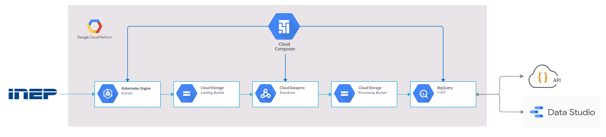

# ETL Censo Escolar

Esse projeto implementa um pipeline de ETL para os dados do [Censo Escolar](https://www.gov.br/inep/pt-br/areas-de-atuacao/pesquisas-estatisticas-e-indicadores/censo-escolar)
utilizando Google Cloud Plataform. 

Os principais recursos da GCP utilizados nesse projeto são o [Composer (Airflow)](https://cloud.google.com/composer),
[GKE (Kubernetes)](https://cloud.google.com/kubernetes-engine), [Dataproc (Spark)](https://cloud.google.com/dataproc)
e [BigQuery](https://cloud.google.com/bigquery). Uma [conta GCP recém criada](https://cloud.google.com/free)
consegue rodar gratuitamente esse projeto. 

O GKE, Dataproc e BigQuery são provisionados pelo Composer. 
O Composer, por sua vez, é provisionado pelo fantástico [Terraform](https://www.terraform.io/). 

O deploy é realizado com poucos comandos no Google Cloud Shell, precisando fazer nada localmente.

## Dados 
#### [Download](https://www.gov.br/inep/pt-br/acesso-a-informacao/dados-abertos/microdados/censo-escolar)
Para esse projeto foram coletados os dados de 2011 até 2020. Em cada ano são 12 arquivos .CSVs: 
5 para matriculas (1 por região do BR),
5 para docentes (1 por região do BR), e 1 arquivo de turmas e escolas.
Em 2019 e 2020 também existe um arquivo para gestores.

## Deploy

1. Faça um fork desse projeto para a sua conta Github.
2. Crie um [projeto](https://console.cloud.google.com/cloud-resource-manager) GCP novo. O nome do projeto será 
utilizado com prefixo dos buckets onde serão armezanados os dados.
3. Acesse [Google Cloud Build](https://console.cloud.google.com/cloud-build/triggers) e crie uma conexão com seu repositório Github.
4. Entre no Google Cloud Shell. O ícone dele está na parte superior do console, próximo a foto da sua conta Google. 
   No aba do Cloud Shell clique no botão ```Abrir editor``` para abrir o Visual Studio Code.
5. Pode ser que o editor não abra porque os cookies de terceiros estão desativados no navegador. Para
contornar isso, pode-se abrir uma exceção para o Cloud Shell no ícone que na direita da barra de endereço.
6. No Visual Studio Code abra um terminal e clone o fork que você realizou desse projeto.
7. No arquivo ```~/etl_censo_escolar/infra/variables.tf``` coloque o nome do projeto que você criou no passo 2 
    e o seu usuário Github. 
8. Execute ```make init``` para ativar as APIs do GCP necessárias para o projeto e para instalar os
plugins Terraform.
9. Execute ```make apply```. Será printado o plano de deploy do Terraform. 
10. Digite yes para aceitar esse plano e começar o deploy do projeto.
11. Após o deploy do último componente (Composer), será printado que um componente não foi deployado corretamente.
    Isso aconteceu porque nesse primeiro apply foi baixado um arquivo no mesmo caminho de build de uma imagem Docker. 
O terraform buga e não constrói a imagem. Para resolver isso execute ```make apply``` novamente
    
12. Ao final de apply será printado o link de acesso do Airflow da GCP, o Composer.
13. As dags do Composer e os arquivos de ETL utlizados pelo Dataproc e BigQuery são sincronizado com o seu repositório Github. 
A sincronização acontece sempre que haver um commit no repositório remoto. Portanto, faça um commit e um push das suas alterações.
    
14. Deploy finalizado! 

# Infra




